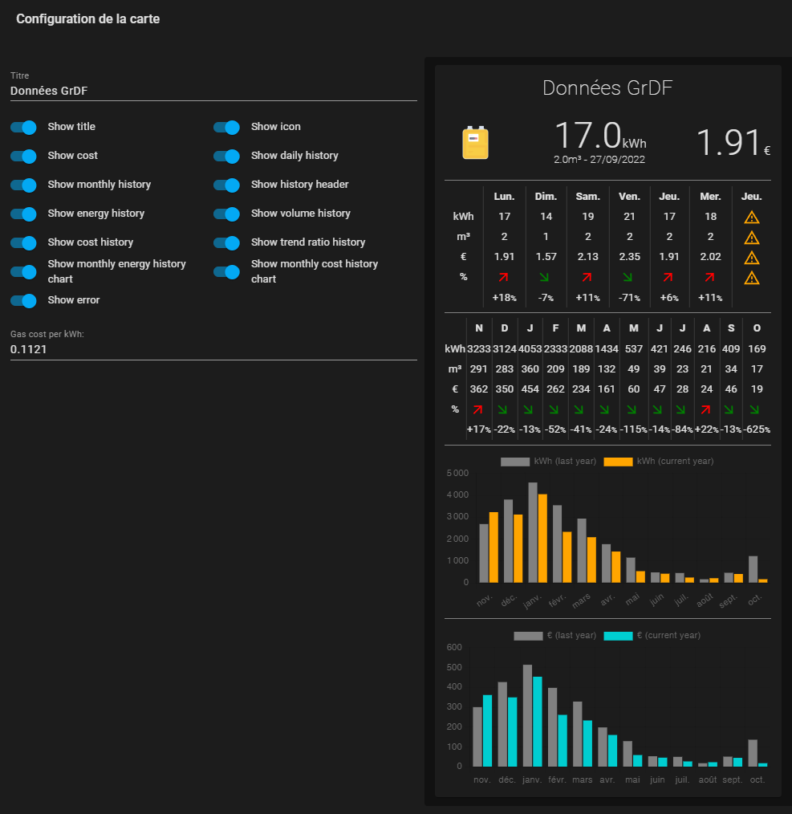

# Home Assistant Lovelace Gazpar Card

## $\text{\color{green}{!!! This component is now compatible with Gazpar2MQTT integration !!!}}$

GrDF Gazpar meter lovelace card for Home Assistant.

This card has been inspired from the great [Linky Card](https://github.com/saniho/content-card-linky).

I reuse the same layout.


It requires:

- Either the HA integration [Gazpar](https://github.com/ssenart/home-assistant-gazpar) at least from version 1.3.0.
- Or the MQTT integration [MQTT](https://github.com/ssenart/gazpar2mqtt) at least from version 0.1.0.

Trend ratio (% in the table) must be interpreted differently depending on the frequency:

- Daily trend ratio is between two days with a week apart (for example, we compare two consecutive Sunday).

- Monthly trend ratio is between two months with a year apart (for example, we compare Feb21 with Feb22).

## Installation

### Method 1 : HACS (recommended)

Follow the steps described below to add GrDF Gazpar integration with [HACS](https://hacs.xyz/):

1. From [HACS](https://hacs.xyz/) (Home Assistant Community Store), open the upper left menu and select `Custom repositories` option to add the new repo.

2. Add the address <https://github.com/ssenart/lovelace-gazpar-card> with the category `Lovelace Plugins`, and click `ADD`. The new corresponding repo appears in the repo list.

3. Select this repo (this integration description is displayed in a window) and click on `INSTALL THIS REPOSITORY` button on the lower right of this window.

4. Keep the last version and click the button `INSTALL` on the lower right.

5. Do click on `RELOAD` button for completion! The integration is now ready. It remains the configuration.

### Method 2 : Manual

1. Copy the content of the dist directory in HA config/www/gazpar-card directory.

2. Add the file path /local/gazpar-card/gazpar-card.js as a new Dashboard ressource (Module JavaScript).

## Configuration

In the configuration panel, play with the toggles and see how it affects the card layout.



Alternatively, you can configure your card manually with the following code:

```yaml
type: custom:gazpar-card

entity: sensor.gazpar
title: Données GrDF
pricePerKWh: '0.06072'

showIcon: true
showTitle: true
showMainBar: true
showCost: true

showDailyHistory: true
showMonthlyHistory: true
showHistoryHeader: true
showEnergyHistory: true
showVolumeHistory: true
showTrendRatioHistory: true
showCostHistory: true

showDailyCostHistoryChart: false
showDailyEnergyHistoryChart: false

showWeeklyEnergyHistoryChart: false
showWeeklyCostHistoryChart: false

showMonthlyEnergyHistoryChart: false
showMonthlyCostHistoryChart: false

showYearlyEnergyHistoryChart: false
showYearlyCostHistoryChart: false

showError: true
showVersion: true
``` 


